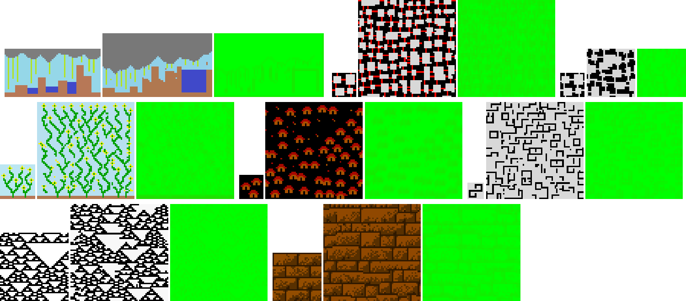

# Wave Function Collapse



My own test of wave function collapse from texture. I don't use tiles, just texture.  
[Online demo](https://namide.github.io/wave-function-collapse/)

_Input images are from the real WaveFunctionCollapse [github.com/mxgmn/WaveFunctionCollapse](https://github.com/mxgmn/WaveFunctionCollapse)_

## Requirements

- Docker + make or
- NodeJS

## Commands with Docker 🐋 and make

```bash
# Install (fist time)
make install

# Run dev server (auto open browser)
make dev
```

Dev server on [localhost:8456](http://localhost:8456/)

## Commands with NodeJS 🟩

```bash
# Install (fist time)
npm run install

# Run dev server
npm run dev
```

Dev server on [localhost:5173](http://localhost:5173/)
