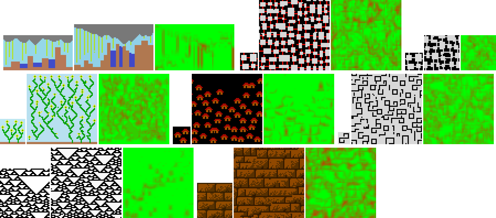

# Wave Function Collapse

Test of custom wave function collapse on texture.



## Requirements

- Docker + make or
- NodeJS

## Commands with Docker 🐋 and make

```bash
# Install (fist time)
make install

# Run dev server (auto open browser)
make dev
```

Dev server on [localhost:8456](http://localhost:8456/)

## Commands with NodeJS 🟩

```bash
# Install (fist time)
npm run install

# Run dev server
npm run dev
```

Dev server on [localhost:5173](http://localhost:5173/)
